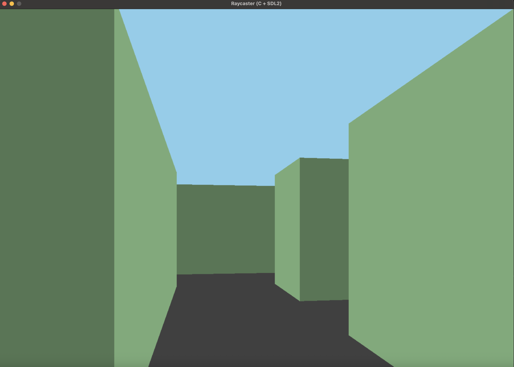

# C Raycaster (Wolfenstein-Style 3D Maze)

A simple **raycasting engine** written in C that renders a 3D maze in real time, inspired by *Wolfenstein 3D*.  
Built from scratch using [SDL2](https://www.libsdl.org/) for window creation, rendering, and input handling.

---

## 🚀 Features
- Classic raycasting (DDA algorithm)
- First-person view of a maze (walls scale larger as you approach)
- Configurable 2D map grid
- Special wall tiles (`2` / `3`) render in alternate colors
- Smooth WASD movement + arrow key rotation
- Runs cross-platform (macOS, Linux, Windows)

---

## 🎮 Controls
| Key | Action |
|-----|---------|
| **W / S** | Move forward / backward |
| **A / D** | Strafe left / right |
| **← / →** | Rotate view left / right |
| **Esc**   | Quit game |

---

## 🧱 Example Map
Here’s the default 16×16 maze (1 = wall, 0 = space, 3 = special tile):

```c
static int worldMap[MAP_H][MAP_W] = {
    {1,1,1,1,1,1,1,1,1,1,1,1,1,1,1,1},
    {1,0,0,1,0,0,0,1,0,0,0,1,0,0,0,1},
    {1,0,1,1,1,0,1,0,1,0,1,0,1,0,1,1},
    {1,0,1,0,0,0,1,0,0,0,1,0,0,1,0,1},
    {1,0,1,0,1,1,1,1,1,0,1,1,0,1,0,1},
    {1,0,0,0,1,0,0,0,1,0,0,0,0,1,0,1},
    {1,1,1,0,1,0,1,0,1,1,1,1,0,1,0,1},
    {1,0,0,0,0,0,1,0,0,0,0,1,0,1,0,1},
    {1,0,1,1,1,0,1,3,1,1,0,1,0,1,0,1},
    {1,0,0,0,1,0,0,0,0,1,0,0,0,1,0,1},
    {1,1,1,0,1,1,1,1,0,1,1,1,0,1,0,1},
    {1,0,0,0,0,0,0,1,0,0,0,1,0,1,0,1},
    {1,0,1,1,1,1,0,1,1,1,0,1,0,1,0,1},
    {1,0,0,0,0,1,0,0,0,1,0,0,0,1,0,1},
    {1,1,1,1,0,1,1,1,0,1,1,1,0,1,0,1},
    {1,1,1,1,1,1,1,1,1,1,1,1,1,1,1,1}
};
```

---

## ⚡ Build Instructions

### macOS (Homebrew)
```bash
brew install sdl2
gcc ray.c -o ray \
  -I"$(brew --prefix sdl2)/include" \
  -L"$(brew --prefix sdl2)/lib" \
  -lSDL2
./ray
```

### Linux (Debian/Ubuntu)
```bash
sudo apt-get install libsdl2-dev
gcc ray.c -o ray -lSDL2 -lm
./ray
```

### Windows (MSYS2 / MinGW)
```bash
pacman -S mingw-w64-x86_64-SDL2
gcc ray.c -o ray -lmingw32 -lSDL2main -lSDL2 -mwindows
```

---

## 📸 Screenshot


*(Replace with a real screenshot of your build running)*

---

## 📚 How It Works
- Each screen column = one ray cast into the 2D grid.
- Rays step cell by cell until they hit a wall (`1`/`2`/`3`).
- Distance to the wall determines line height (closer walls look taller).
- Vertical colored stripe is drawn for that wall slice.
- Repeat for every column → 3D illusion.

---

## 🛠️ Next Steps
- Textured walls
- Minimap overlay
- Doors that open/close
- Sprites (enemies, items)
- Collision improvements

---

## 📄 License
MIT License. Free to use and modify.

---

## 👤 Author
Built by **Nick Miller** as a learning project in C and computer graphics.
